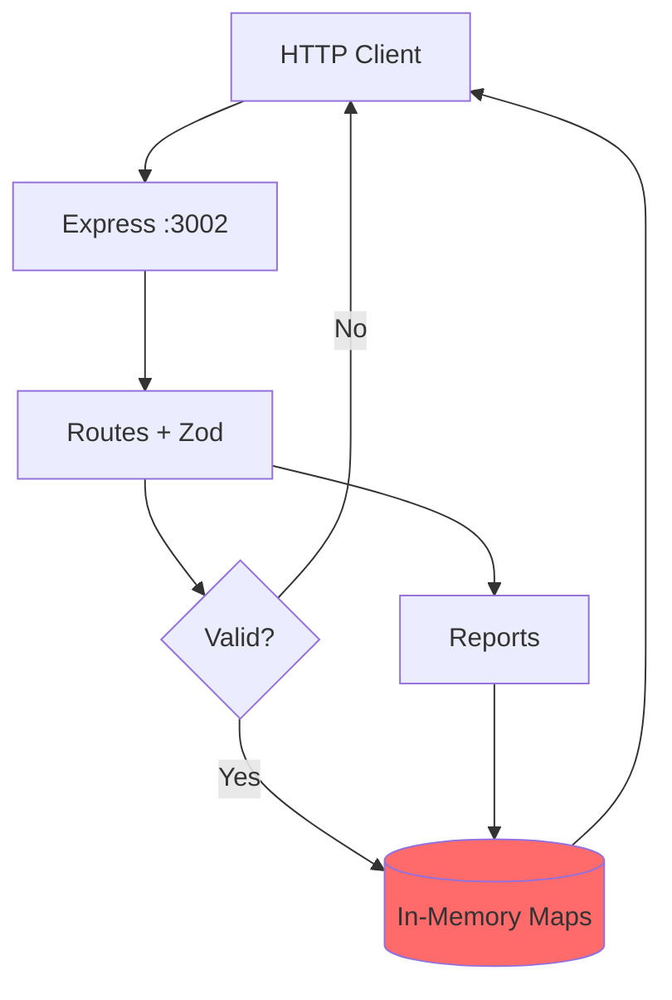
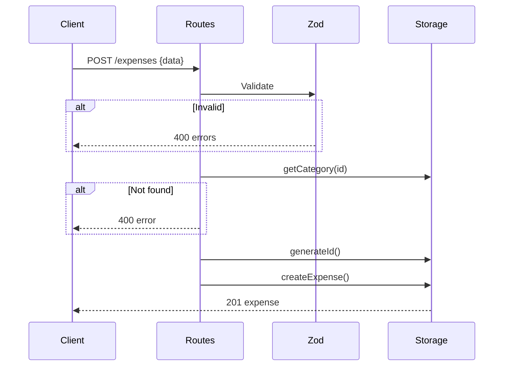

**Last Updated:** 11/18/2025

---


# Architecture Documentation

Comprehensive system design, data flow, and technical specifications for the Expense Logger application.

## System Overview

{/* 
Sources:
- aidan-doc/docs/architecture/overview.md (architecture diagrams, component descriptions)
- claude-doc/docs/architecture/overview.md (mermaid diagram, layer descriptions)
- backend/src/index.ts (Express setup, middleware configuration)
- backend/src/routes.ts (API endpoints structure)
- backend/src/storage.ts (data layer implementation)
*/}

Expense Logger follows a classic three-tier architecture pattern with clear separation between presentation, application, and data layers.

### High-Level Architecture

```
┌─────────────────────────────────────────────────────────────┐
│                     Presentation Layer                       │
│  ┌────────────┐  ┌────────────┐  ┌──────────────────────┐  │
│  │  HTML/CSS  │  │ JavaScript │  │ Chart.js Visualizations │
│  │  (UI)      │  │ (Logic)    │  │  (Charts)              │
│  └────────────┘  └────────────┘  └──────────────────────┘  │
└───────────────────────────┬─────────────────────────────────┘
                            │ HTTP/REST (JSON)
                            │ CORS Enabled
┌───────────────────────────┴─────────────────────────────────┐
│                    Application Layer                         │
│  ┌─────────┐  ┌──────────┐  ┌──────────┐  ┌─────────────┐  │
│  │ Routes  │→ │ Validation│→ │ Business │→ │   Storage   │  │
│  │ Express │  │   Zod     │  │  Logic   │  │   Access    │  │
│  └─────────┘  └──────────┘  └──────────┘  └─────────────┘  │
└───────────────────────────┬─────────────────────────────────┘
                            │ In-Memory Operations
┌───────────────────────────┴─────────────────────────────────┐
│                      Data Layer                              │
│  ┌────────────┐  ┌────────────┐  ┌───────────────────────┐  │
│  │ Expenses   │  │ Categories │  │  Budget Settings      │  │
│  │   Map      │  │    Map     │  │       Map             │  │
│  └────────────┘  └────────────┘  └───────────────────────┘  │
└─────────────────────────────────────────────────────────────┘
```

### System Diagram with Data Flow



### High-Level Architecture

```
┌─────────────────────────────────────────────────────────────┐
│                     Presentation Layer                       │
│  ┌────────────┐  ┌────────────┐  ┌──────────────────────┐  │
│  │  HTML/CSS  │  │ JavaScript │  │ Chart.js Visualizations │
│  │  (UI)      │  │ (Logic)    │  │  (Charts)              │
│  └────────────┘  └────────────┘  └──────────────────────┘  │
└───────────────────────────┬─────────────────────────────────┘
                            │ HTTP/REST (JSON)
                            │ CORS Enabled
┌───────────────────────────┴─────────────────────────────────┐
│                    Application Layer                         │
│  ┌─────────┐  ┌──────────┐  ┌──────────┐  ┌─────────────┐  │
│  │ Routes  │→ │ Validation│→ │ Business │→ │   Storage   │  │
│  │ Express │  │   Zod     │  │  Logic   │  │   Access    │  │
│  └─────────┘  └──────────┘  └──────────┘  └─────────────┘  │
└───────────────────────────┬─────────────────────────────────┘
                            │ In-Memory Operations
┌───────────────────────────┴─────────────────────────────────┐
│                      Data Layer                              │
│  ┌────────────┐  ┌────────────┐  ┌───────────────────────┐  │
│  │ Expenses   │  │ Categories │  │  Budget Settings      │  │
│  │   Map      │  │    Map     │  │       Map             │  │
│  └────────────┘  └────────────┘  └───────────────────────┘  │
└─────────────────────────────────────────────────────────────┘
```

### System Diagram with Data Flow


## Component Architecture

{/* 
Sources:
- frontend/js/app.js (frontend functions and logic)
- frontend/index.html (UI structure)
- frontend/css/style.css (styling)
- backend/src/ (all backend component files)
- aidan-doc/docs/architecture/overview.md (component descriptions)
*/}

## Frontend Components (Presentation Layer)

Location: frontend/

```
frontend/
├── index.html           # Single-page application structure
├── js/
│   └── app.js          # Application logic (365 lines)
└── css/
    └── style.css       # Styling and theme (470 lines)
```

Responsibilities:

Render user interface componentsHandle user interactions (form submission, clicks)Make API calls using FetchUpdate DOM based on API responsesRender Chart.js visualizationsClient-side filtering and sorting

Key Functions in app.js:

apiCall() - HTTP request wrapper with error handlingloadCategories() - Fetch and populate category dropdownloadBudget() - Fetch and display budget statusloadExpenses() - Fetch and render expense listloadStats() - Calculate and display statisticsupdateCategoryChart() - Render category breakdown chartupdatePaymentChart() - Render payment method chart

## Backend Components (Application Layer)

Location: backend/src/

```
backend/src/
├── index.ts          # Express app setup, middleware (53 lines)
├── routes.ts         # Route handlers, validation (223 lines)
├── models.ts         # TypeScript interfaces (56 lines)
├── storage.ts        # Data persistence layer (68 lines)
├── reports.ts        # Business logic for reports (77 lines)
├── categories.ts     # Default categories config (11 lines)
└── swagger.ts        # OpenAPI specification (22 lines)
```

#### index.ts - Application Entry Point

{/* 
Sources:
- backend/src/index.ts (Express configuration, middleware setup)
- aidan-doc/docs/architecture/overview.md (server configuration details)
*/}

Location: index.ts

Responsibilities:

Initialize Express applicationConfigure middleware (CORS, JSON parser, logging)Mount routes at /api/v1Set up Swagger UI at /api-docsStart HTTP server on port 3002Global error handling

Key Configuration:

```typescript
const app = express();
app.use(cors());                    // Enable CORS
app.use(express.json());            // Parse JSON bodies
app.use('/api/v1', router);         // Mount API routes
app.use('/api-docs', swaggerUi);    // API documentation
```

#### routes.ts - Request Handlers

{/* 
Sources:
- backend/src/routes.ts (route definitions, validation schemas, handlers)
- aidan-doc/docs/architecture/overview.md (endpoint categories)
*/}

Location: routes.ts

Responsibilities:

Define REST endpointsValidate request data with Zod schemasCall storage methodsFormat responsesHandle errors (400, 404, 500)

Endpoint Categories:

Expense CRUD (5 endpoints)Category Management (2 endpoints)Financial Reports (2 endpoints)Budget Tracking (2 endpoints)

Validation Flow:

```
Request → Zod Schema → Parse → Validate → Pass/Fail → Handler
```

Zod Validation Schemas:

Located at routes.ts:10-21, these schemas validate all inputs:

```typescript
const expenseCreateSchema = z.object({
  amount: z.number().positive(),
  description: z.string().min(1).max(500).optional(),
  category: z.string(),
  paymentMethod: z.nativeEnum(PaymentMethod),
  date: z.string()
});
```

#### models.ts - Type Definitions

{/* 
Sources:
- backend/src/models.ts (TypeScript interfaces and enums)
- aidan-doc/docs/architecture/data-models.md (type documentation)
*/}

Location: models.ts

TypeScript interfaces for type safety: Expense, Category, PaymentMethod, reports.

Core Interfaces:

```typescript
enum PaymentMethod {
  CASH = 'cash',
  CREDIT_CARD = 'credit_card',
  DEBIT_CARD = 'debit_card',
  BANK_TRANSFER = 'bank_transfer',
  DIGITAL_WALLET = 'digital_wallet'
}

interface Expense {
  id: string;
  amount: number;
  description: string;
  categoryId: string;
  paymentMethod: PaymentMethod;
  date: string;
  createdAt: string;
  updatedAt: string;
}

interface Category {
  id: string;
  name: string;
  color: string;
  isCustom: boolean;
}

interface BudgetStatus {
  monthlyLimit: number;
  spent: number;
  remaining: number;
  percentageUsed: number;
  isOverBudget: boolean;
}
```

#### storage.ts - Data Persistence

{/* 
Sources:
- backend/src/storage.ts (ExpenseStorage class, Map data structures, CRUD methods)
- aidan-doc/docs/architecture/overview.md (ID generation strategy)
*/}

Location: storage.ts

Class: ExpenseStorage

In-memory Maps for expenses and categories. CRUD operations with O(1) lookups.

Data Structures:

```typescript
private expenses: Map<string, Expense> = new Map();
private categories: Map<string, Category> = new Map();
private settings: Map<string, any> = new Map();
```

Methods:

createExpense() - Add new expense with generated IDgetAllExpenses() - Retrieve all expensesgetExpenseById() - Find single expenseupdateExpense() - Modify existing expensedeleteExpense() - Remove expensecreateCategory() - Add custom categorygetAllCategories() - Get all categoriesgetCategoryById() - Find category by IDgetBudgetSettings() - Get budget configsetBudgetLimit() - Update budget limit

ID Generation Strategy:

Located at storage.ts:15-21:

```typescript
Expenses: exp_${counter}  // exp_1, exp_2, exp_3...
Categories: cat_${counter} // cat_1, cat_2, cat_3...
```

Rationale: Readable for debugging (exp_1, exp_2).Tradeoff: Predictable, enumeration risk.Migration: Use crypto.randomUUID() for production.

Production Concern: Replace with Prisma + PostgreSQL for data persistence.

#### reports.ts - Business Logic

{/* 
Sources:
- backend/src/reports.ts (report generation functions, date filtering)
- aidan-doc/docs/architecture/overview.md (business logic description)
*/}

Location: reports.ts

Generates summaries and category breakdowns. Uses date-fns for filtering.

Functions:

getExpenseSummary(startDate, endDate)Filters expenses by date rangeCalculates: total amount, count, averageFinds highest expenseUses date-fns for date operationsgetCategoryBreakdown(startDate, endDate)Groups expenses by categoryCalculates total per categoryComputes percentage of totalSorts by amount (descending)getCurrentMonthSpending()Determines current month boundariesFilters expenses in current monthReturns total spent

Date Handling:

```typescript
import { parseISO, isWithinInterval, startOfMonth, endOfMonth } from 'date-fns';

const start = startOfMonth(new Date());
const end = endOfMonth(new Date());
```

#### swagger.ts - OpenAPI Specification

{/* 
Sources:
- backend/src/swagger.ts (OpenAPI configuration)
- aidan-doc/static/openapi.json (generated API documentation)
*/}

Location: swagger.ts

Complete API documentation. Generated to aidan-doc/static/openapi.json.

## Frontend Components (Presentation Layer)

Location: frontend/

```
frontend/
├── index.html           # Single-page application structure
├── js/
│   └── app.js          # Application logic (365 lines)
└── css/
    └── style.css       # Styling and theme (470 lines)
```

Responsibilities:

Render user interface componentsHandle user interactions (form submission, clicks)Make API calls using FetchUpdate DOM based on API responsesRender Chart.js visualizationsClient-side filtering and sorting

Key Functions in app.js:

apiCall() - HTTP request wrapper with error handlingloadCategories() - Fetch and populate category dropdownloadBudget() - Fetch and display budget statusloadExpenses() - Fetch and render expense listloadStats() - Calculate and display statisticsupdateCategoryChart() - Render category breakdown chartupdatePaymentChart() - Render payment method chart

## Backend Components (Application Layer)

Location: backend/src/

```
backend/src/
├── index.ts          # Express app setup, middleware (53 lines)
├── routes.ts         # Route handlers, validation (223 lines)
├── models.ts         # TypeScript interfaces (56 lines)
├── storage.ts        # Data persistence layer (68 lines)
├── reports.ts        # Business logic for reports (77 lines)
├── categories.ts     # Default categories config (11 lines)
└── swagger.ts        # OpenAPI specification (22 lines)
```

#### index.ts - Application Entry Point

Location: index.ts

Responsibilities:

Initialize Express applicationConfigure middleware (CORS, JSON parser, logging)Mount routes at /api/v1Set up Swagger UI at /api-docsStart HTTP server on port 3002Global error handling

Key Configuration:

```typescript
const app = express();
app.use(cors());                    // Enable CORS
app.use(express.json());            // Parse JSON bodies
app.use('/api/v1', router);         // Mount API routes
app.use('/api-docs', swaggerUi);    // API documentation
```

#### routes.ts - Request Handlers

Location: routes.ts

Responsibilities:

Define REST endpointsValidate request data with Zod schemasCall storage methodsFormat responsesHandle errors (400, 404, 500)

Endpoint Categories:

Expense CRUD (5 endpoints)Category Management (2 endpoints)Financial Reports (2 endpoints)Budget Tracking (2 endpoints)

Validation Flow:

```
Request → Zod Schema → Parse → Validate → Pass/Fail → Handler
```

Zod Validation Schemas:

Located at routes.ts:10-21, these schemas validate all inputs:

```typescript
const expenseCreateSchema = z.object({
  amount: z.number().positive(),
  description: z.string().min(1).max(500).optional(),
  category: z.string(),
  paymentMethod: z.nativeEnum(PaymentMethod),
  date: z.string()
});
```

#### models.ts - Type Definitions

Location: models.ts

TypeScript interfaces for type safety: Expense, Category, PaymentMethod, reports.

Core Interfaces:

```typescript
enum PaymentMethod {
  CASH = 'cash',
  CREDIT_CARD = 'credit_card',
  DEBIT_CARD = 'debit_card',
  BANK_TRANSFER = 'bank_transfer',
  DIGITAL_WALLET = 'digital_wallet'
}

interface Expense {
  id: string;
  amount: number;
  description: string;
  categoryId: string;
  paymentMethod: PaymentMethod;
  date: string;
  createdAt: string;
  updatedAt: string;
}

interface Category {
  id: string;
  name: string;
  color: string;
  isCustom: boolean;
}

interface BudgetStatus {
  monthlyLimit: number;
  spent: number;
  remaining: number;
  percentageUsed: number;
  isOverBudget: boolean;
}
```

#### storage.ts - Data Persistence

Location: storage.ts

Class: ExpenseStorage

In-memory Maps for expenses and categories. CRUD operations with O(1) lookups.

Data Structures:

```typescript
private expenses: Map<string, Expense> = new Map();
private categories: Map<string, Category> = new Map();
private settings: Map<string, any> = new Map();
```

Methods:

createExpense() - Add new expense with generated IDgetAllExpenses() - Retrieve all expensesgetExpenseById() - Find single expenseupdateExpense() - Modify existing expensedeleteExpense() - Remove expensecreateCategory() - Add custom categorygetAllCategories() - Get all categoriesgetCategoryById() - Find category by IDgetBudgetSettings() - Get budget configsetBudgetLimit() - Update budget limit

ID Generation Strategy:

Located at storage.ts:15-21:

```typescript
Expenses: exp_${counter}  // exp_1, exp_2, exp_3...
Categories: cat_${counter} // cat_1, cat_2, cat_3...
```

Rationale: Readable for debugging (exp_1, exp_2).Tradeoff: Predictable, enumeration risk.Migration: Use crypto.randomUUID() for production.

Production Concern: Replace with Prisma + PostgreSQL for data persistence.

#### reports.ts - Business Logic

Location: reports.ts

Generates summaries and category breakdowns. Uses date-fns for filtering.

Functions:

getExpenseSummary(startDate, endDate)Filters expenses by date rangeCalculates: total amount, count, averageFinds highest expenseUses date-fns for date operationsgetCategoryBreakdown(startDate, endDate)Groups expenses by categoryCalculates total per categoryComputes percentage of totalSorts by amount (descending)getCurrentMonthSpending()Determines current month boundariesFilters expenses in current monthReturns total spent

Date Handling:

```typescript
import { parseISO, isWithinInterval, startOfMonth, endOfMonth } from 'date-fns';

const start = startOfMonth(new Date());
const end = endOfMonth(new Date());
```

#### swagger.ts - OpenAPI Specification

Location: swagger.ts

Complete API documentation. Generated to aidan-doc/static/openapi.json.

## Data Flow Patterns

{/* 
Sources:
- backend/src/routes.ts (request handling flow)
- backend/src/storage.ts (data operations)
- frontend/js/app.js (client-side request flow)
- aidan-doc/docs/architecture/overview.md (data flow descriptions)
- claude-doc/docs/architecture/overview.md (sequence diagrams)
*/}

### Creating an Expense



Detailed Flow:

User fills form in frontendJavaScript validates and sends POST /api/v1/expensesBody: { amount, description, categoryId, paymentMethod, date }Express receives request at routes.tsZod schema validates request body✓ amount is positive number✓ categoryId exists✓ paymentMethod is valid enum✓ date is valid ISO 8601Route handler calls storage.createExpense()Storage layer:Generates unique ID (exp_${counter})Adds timestamps (createdAt, updatedAt)Stores in MapReturns expense object to route handlerRoute handler sends JSON response (201 Created)Frontend receives responseUpdates expense listRecalculates statisticsRefreshes charts

### Budget Status Check

Flow:

Frontend calls GET /api/v1/budget on page loadRoute handler calls:storage.getBudgetSettings() → monthlyLimitgetCurrentMonthSpending() → spent amountBusiness logic calculates:remaining = monthlyLimit - spentpercentageUsed = (spent / monthlyLimit) * 100isOverBudget = spent > monthlyLimitReturns BudgetStatus objectFrontend renders:Progress bar (color based on percentage)Spent and remaining amountsOver-budget warning if applicable

### CRUD Operation Patterns

Create Operation (POST)

```
Client → Validation → ID Generation → Storage → Response → UI Update
```

Read Operation (GET)

```
Client → Query Params → Filter/Sort → Storage → Response → UI Render
```

Update Operation (PUT)

```
Client → Validation → Find by ID → Merge Changes → Storage → Response → UI Update
```

Delete Operation (DELETE)

```
Client → Confirm → Find by ID → Remove → Response → UI Update
```

### Creating an Expense


Detailed Flow:

User fills form in frontendJavaScript validates and sends POST /api/v1/expensesBody: { amount, description, categoryId, paymentMethod, date }Express receives request at routes.tsZod schema validates request body✓ amount is positive number✓ categoryId exists✓ paymentMethod is valid enum✓ date is valid ISO 8601Route handler calls storage.createExpense()Storage layer:Generates unique ID (exp_${counter})Adds timestamps (createdAt, updatedAt)Stores in MapReturns expense object to route handlerRoute handler sends JSON response (201 Created)Frontend receives responseUpdates expense listRecalculates statisticsRefreshes charts

### Budget Status Check

Flow:

Frontend calls GET /api/v1/budget on page loadRoute handler calls:storage.getBudgetSettings() → monthlyLimitgetCurrentMonthSpending() → spent amountBusiness logic calculates:remaining = monthlyLimit - spentpercentageUsed = (spent / monthlyLimit) * 100isOverBudget = spent > monthlyLimitReturns BudgetStatus objectFrontend renders:Progress bar (color based on percentage)Spent and remaining amountsOver-budget warning if applicable

### CRUD Operation Patterns

Create Operation (POST)

```
Client → Validation → ID Generation → Storage → Response → UI Update
```

Read Operation (GET)

```
Client → Query Params → Filter/Sort → Storage → Response → UI Render
```

Update Operation (PUT)

```
Client → Validation → Find by ID → Merge Changes → Storage → Response → UI Update
```

Delete Operation (DELETE)

```
Client → Confirm → Find by ID → Remove → Response → UI Update
```

## Data Models

{/* 
Sources:
- backend/src/models.ts (all interface definitions)
- backend/src/routes.ts (validation schemas)
- backend/src/categories.ts (default categories)
- aidan-doc/docs/architecture/data-models.md (comprehensive data model documentation)
- claude-doc/docs/architecture/data-models.md (validation rules, examples)
*/}

Complete reference for all data models and validation rules.

### Core Types


#### Expense

Interface Definition:

```typescript
interface Expense {
  id: string;              // exp_1, exp_2, ...
  amount: number;          // Must be > 0
  description?: string;    // Optional, max 500 chars
  category: string;        // Must reference existing category
  paymentMethod: PaymentMethod;
  date: string;            // ISO 8601 datetime
  createdAt: string;       // Auto-generated
  updatedAt: string;       // Auto-updated
}
```

Source: models.ts:16-25

#### ExpenseCreate

Request payload for creating/updating expenses.

```typescript
interface ExpenseCreate {
  amount: number;           // Required, must be > 0
  description: string;      // Optional
  category: string;         // Required, must exist
  paymentMethod: PaymentMethod;  // Required
  date: string;             // Required, ISO 8601
}
```

Validation (routes.ts:10-16):

amount: z.number().positive()description: z.string().min(1).max(500).optional()category: z.string() (checked against storage)paymentMethod: z.nativeEnum(PaymentMethod)date: z.string()

#### Category

```typescript
interface Category {
  id: string;              // cat_1, cat_2, ...
  name: string;            // Display name
  color: string;           // Hex color #FF6B6B
  isCustom: boolean;       // false = default, true = user-created
}
```

Default Categories (categories.ts:3-11):

```typescript
[
  { id: 'cat_1', name: 'Food & Dining', color: '#FF6B6B', isCustom: false },
  { id: 'cat_2', name: 'Transportation', color: '#4ECDC4', isCustom: false },
  { id: 'cat_3', name: 'Utilities', color: '#45B7D1', isCustom: false },
  { id: 'cat_4', name: 'Entertainment', color: '#FFA07A', isCustom: false },
  { id: 'cat_5', name: 'Healthcare', color: '#98D8C8', isCustom: false },
  { id: 'cat_6', name: 'Shopping', color: '#F7DC6F', isCustom: false },
  { id: 'cat_7', name: 'Other', color: '#95A5A6', isCustom: false }
]
```

#### PaymentMethod

```typescript
enum PaymentMethod {
  CASH = 'cash',
  CREDIT_CARD = 'credit_card',
  DEBIT_CARD = 'debit_card',
  BANK_TRANSFER = 'bank_transfer',
  DIGITAL_WALLET = 'digital_wallet'
}
```

Source: models.ts:1-7

### Report Types


#### ExpenseSummary

```typescript
interface ExpenseSummary {
  totalExpenses: number;       // Count
  totalAmount: number;         // Sum
  averageAmount: number;       // Average
  highestExpense: Expense | null;
  period: { startDate: string; endDate: string };
}
```

Example:

```json
{
  "totalExpenses": 327.48,
  "numberOfExpenses": 8,
  "averageExpense": 40.94,
  "highestExpense": {
    "id": "exp_5",
    "amount": 129.99,
    "description": "New headphones"
  },
  "dateRange": {
    "start": "2025-11-01",
    "end": "2025-11-30"
  }
}
```

#### CategoryBreakdown

```typescript
interface CategoryBreakdown {
  category: Category;
  totalAmount: number;
  expenseCount: number;
  percentage: number;          // 0-100, 1 decimal place
}
```

Returned as array sorted by totalAmount descending.

Example:

```json
[
  {
    "categoryId": "cat_1",
    "categoryName": "Food & Dining",
    "totalAmount": 145.50,
    "percentage": 44.4
  },
  {
    "categoryId": "cat_2",
    "categoryName": "Transportation",
    "totalAmount": 98.00,
    "percentage": 29.9
  }
]
```

#### BudgetStatus

```typescript
interface BudgetStatus {
  monthlyLimit: number;
  currentMonthSpending: number;
  remaining: number;           // Never negative
  percentageUsed: number;      // 0 if limit is 0
  isOverBudget: boolean;
}
```

Calculation (routes.ts:187-195):

```typescript
remaining: Math.max(0, monthlyLimit - currentSpending),
percentageUsed: monthlyLimit > 0
  ? Math.round((currentSpending / monthlyLimit) * 100 * 10) / 10
  : 0
```

### Validation Rules

| Field | Type | Required | Constraints |
|-------|------|----------|-------------|
| amount | number | Yes | > 0 |
| description | string | No | 1-500 chars if provided |
| category | string | Yes | Must exist |
| paymentMethod | enum | Yes | One of 5 values |
| date | string | Yes | ISO 8601 |
| name (category) | string | Yes | 1-100 chars, unique |
| color (category) | string | Yes | Hex: ^#[0-9A-Fa-f]{6}$ |
| monthlyLimit | number | Yes | > 0 |

Source: routes.ts:10-21

### Date Format

ISO 8601 with timezone: YYYY-MM-DDTHH:mm:ss.sssZ

Examples:

2025-01-15T12:30:00Z (UTC)2025-01-15T00:00:00Z (start of day)

### Error Responses

```typescript
interface ErrorResponse {
  error: string;      // Simple message
  errors?: any;       // Zod validation errors
}
```

Common messages:

"Expense not found""Invalid category ID""Category name already exists""startDate and endDate are required""Invalid date format"

### Core Types


#### Expense

Interface Definition:

```typescript
interface Expense {
  id: string;              // exp_1, exp_2, ...
  amount: number;          // Must be > 0
  description?: string;    // Optional, max 500 chars
  category: string;        // Must reference existing category
  paymentMethod: PaymentMethod;
  date: string;            // ISO 8601 datetime
  createdAt: string;       // Auto-generated
  updatedAt: string;       // Auto-updated
}
```

Source: models.ts:16-25

#### ExpenseCreate

Request payload for creating/updating expenses.

```typescript
interface ExpenseCreate {
  amount: number;           // Required, must be > 0
  description: string;      // Optional
  category: string;         // Required, must exist
  paymentMethod: PaymentMethod;  // Required
  date: string;             // Required, ISO 8601
}
```

Validation (routes.ts:10-16):

amount: z.number().positive()description: z.string().min(1).max(500).optional()category: z.string() (checked against storage)paymentMethod: z.nativeEnum(PaymentMethod)date: z.string()

#### Category

```typescript
interface Category {
  id: string;              // cat_1, cat_2, ...
  name: string;            // Display name
  color: string;           // Hex color #FF6B6B
  isCustom: boolean;       // false = default, true = user-created
}
```

Default Categories (categories.ts:3-11):

```typescript
[
  { id: 'cat_1', name: 'Food & Dining', color: '#FF6B6B', isCustom: false },
  { id: 'cat_2', name: 'Transportation', color: '#4ECDC4', isCustom: false },
  { id: 'cat_3', name: 'Utilities', color: '#45B7D1', isCustom: false },
  { id: 'cat_4', name: 'Entertainment', color: '#FFA07A', isCustom: false },
  { id: 'cat_5', name: 'Healthcare', color: '#98D8C8', isCustom: false },
  { id: 'cat_6', name: 'Shopping', color: '#F7DC6F', isCustom: false },
  { id: 'cat_7', name: 'Other', color: '#95A5A6', isCustom: false }
]
```

#### PaymentMethod

```typescript
enum PaymentMethod {
  CASH = 'cash',
  CREDIT_CARD = 'credit_card',
  DEBIT_CARD = 'debit_card',
  BANK_TRANSFER = 'bank_transfer',
  DIGITAL_WALLET = 'digital_wallet'
}
```

Source: models.ts:1-7

### Report Types


#### ExpenseSummary

```typescript
interface ExpenseSummary {
  totalExpenses: number;       // Count
  totalAmount: number;         // Sum
  averageAmount: number;       // Average
  highestExpense: Expense | null;
  period: { startDate: string; endDate: string };
}
```

Example:

```json
{
  "totalExpenses": 327.48,
  "numberOfExpenses": 8,
  "averageExpense": 40.94,
  "highestExpense": {
    "id": "exp_5",
    "amount": 129.99,
    "description": "New headphones"
  },
  "dateRange": {
    "start": "2025-11-01",
    "end": "2025-11-30"
  }
}
```

#### CategoryBreakdown

```typescript
interface CategoryBreakdown {
  category: Category;
  totalAmount: number;
  expenseCount: number;
  percentage: number;          // 0-100, 1 decimal place
}
```

Returned as array sorted by totalAmount descending.

Example:

```json
[
  {
    "categoryId": "cat_1",
    "categoryName": "Food & Dining",
    "totalAmount": 145.50,
    "percentage": 44.4
  },
  {
    "categoryId": "cat_2",
    "categoryName": "Transportation",
    "totalAmount": 98.00,
    "percentage": 29.9
  }
]
```

#### BudgetStatus

```typescript
interface BudgetStatus {
  monthlyLimit: number;
  currentMonthSpending: number;
  remaining: number;           // Never negative
  percentageUsed: number;      // 0 if limit is 0
  isOverBudget: boolean;
}
```

Calculation (routes.ts:187-195):

```typescript
remaining: Math.max(0, monthlyLimit - currentSpending),
percentageUsed: monthlyLimit > 0
  ? Math.round((currentSpending / monthlyLimit) * 100 * 10) / 10
  : 0
```

### Validation Rules

| Field | Type | Required | Constraints |
|-------|------|----------|-------------|
| amount | number | Yes | > 0 |
| description | string | No | 1-500 chars if provided |
| category | string | Yes | Must exist |
| paymentMethod | enum | Yes | One of 5 values |
| date | string | Yes | ISO 8601 |
| name (category) | string | Yes | 1-100 chars, unique |
| color (category) | string | Yes | Hex: ^#[0-9A-Fa-f]{6}$ |
| monthlyLimit | number | Yes | > 0 |

Source: routes.ts:10-21

### Date Format

ISO 8601 with timezone: YYYY-MM-DDTHH:mm:ss.sssZ

Examples:

2025-01-15T12:30:00Z (UTC)2025-01-15T00:00:00Z (start of day)

### Error Responses

```typescript
interface ErrorResponse {
  error: string;      // Simple message
  errors?: any;       // Zod validation errors
}
```

Common messages:

"Expense not found""Invalid category ID""Category name already exists""startDate and endDate are required""Invalid date format"

## Validation Architecture

{/* 
Sources:
- backend/src/routes.ts (Zod validation schemas)
- frontend/index.html (HTML5 validation attributes)
- frontend/js/app.js (client-side validation)
- aidan-doc/docs/architecture/overview.md (validation layer description)
*/}

### Two-Layer Validation


## 1. Client-Side (Frontend)

HTML5 Validation:

```html
<input type="number" min="0.01" step="0.01" required>
<input type="date" required>
```

JavaScript Validation:

```javascript
if (amount <= 0) {
  alert('Amount must be positive');
  return;
}
```

## 2. Server-Side (Backend)

Zod Schema Validation:

```typescript
const expenseCreateSchema = z.object({
  amount: z.number().positive(),
  description: z.string().min(1),
  categoryId: z.string().min(1),
  paymentMethod: z.enum(['cash', 'credit_card', 'debit_card', 'bank_transfer', 'digital_wallet']),
  date: z.string().refine((date) => !isNaN(Date.parse(date)))
});
```

Benefits:

Type safety at runtimeAutomatic error messagesSchema documentationPrevents invalid data in storage

Rationale: Type-safe runtime validation with TypeScript inference.Alternative: express-validator (rejected, weaker TypeScript integration).

### Two-Layer Validation


## 1. Client-Side (Frontend)

HTML5 Validation:

```html
<input type="number" min="0.01" step="0.01" required>
<input type="date" required>
```

JavaScript Validation:

```javascript
if (amount <= 0) {
  alert('Amount must be positive');
  return;
}
```

## 2. Server-Side (Backend)

Zod Schema Validation:

```typescript
const expenseCreateSchema = z.object({
  amount: z.number().positive(),
  description: z.string().min(1),
  categoryId: z.string().min(1),
  paymentMethod: z.enum(['cash', 'credit_card', 'debit_card', 'bank_transfer', 'digital_wallet']),
  date: z.string().refine((date) => !isNaN(Date.parse(date)))
});
```

Benefits:

Type safety at runtimeAutomatic error messagesSchema documentationPrevents invalid data in storage

Rationale: Type-safe runtime validation with TypeScript inference.Alternative: express-validator (rejected, weaker TypeScript integration).

## Error Handling

{/* 
Sources:
- backend/src/routes.ts (error handling implementation, HTTP status codes)
- aidan-doc/docs/architecture/overview.md (error flow documentation)
*/}

### HTTP Status Codes

| Code | Meaning | Usage |
|------|---------|-------|
| 200 | OK | Successful GET, PUT |
| 201 | Created | Successful POST |
| 204 | No Content | Successful DELETE |
| 400 | Bad Request | Validation failure |
| 404 | Not Found | Resource doesn't exist |
| 500 | Internal Server Error | Unexpected errors |

### Error Flow

```typescript
try {
  // Validation
  const validated = schema.parse(req.body);

  // Business logic
  const result = storage.operation(validated);

  // Success response
  res.status(201).json(result);
} catch (error) {
  if (error instanceof z.ZodError) {
    // Validation error
    res.status(400).json({ error: error.errors });
  } else {
    // Internal error
    res.status(500).json({ error: 'Internal server error' });
  }
}
```

### HTTP Status Codes

| Code | Meaning | Usage |
|------|---------|-------|
| 200 | OK | Successful GET, PUT |
| 201 | Created | Successful POST |
| 204 | No Content | Successful DELETE |
| 400 | Bad Request | Validation failure |
| 404 | Not Found | Resource doesn't exist |
| 500 | Internal Server Error | Unexpected errors |

### Error Flow

```typescript
try {
  // Validation
  const validated = schema.parse(req.body);

  // Business logic
  const result = storage.operation(validated);

  // Success response
  res.status(201).json(result);
} catch (error) {
  if (error instanceof z.ZodError) {
    // Validation error
    res.status(400).json({ error: error.errors });
  } else {
    // Internal error
    res.status(500).json({ error: 'Internal server error' });
  }
}
```

## Technology Stack

{/* 
Sources:
- backend/package.json (dependency versions)
- PROJECT_SPEC.md (technology choices)
- aidan-doc/docs/architecture/overview.md (technology rationale)
- claude-doc/docs/architecture/overview.md (technology descriptions)
*/}

| Tech | Version | Purpose |
|------|---------|---------|
| Node.js | 20.10.6+ | Runtime |
| TypeScript | 5.3.3 | Type safety |
| Express | 4.18.2 | Web framework |
| Zod | 3.22.4 | Validation |
| date-fns | 2.30.0 | Date handling |
| swagger-jsdoc | 6.2.8 | OpenAPI generation |

### Technology Choices & Rationale


#### Why Express.js?

Minimal, unopinionated frameworkLarge ecosystem of middlewareWell-documented and stableEasy to learn and understandPerfect for REST APIs

#### Why TypeScript?

Type safety prevents runtime errorsBetter IDE support and autocompleteSelf-documenting codeEasier refactoringCatches bugs at compile time

#### Why Zod?

Runtime validation (TypeScript only validates at compile time)Schema-based validationAutomatic type inferenceExcellent error messagesIntegrates well with TypeScript

#### Why date-fns?

Immutable date operationsTree-shakeable (small bundle size)Pure functions (no Date.prototype pollution)Better than Moment.js (deprecated)TypeScript support

#### Why In-Memory Storage?

Zero setup requiredFast development iterationNo database configurationEasy to understandSufficient for demos and prototypes

Location: storage.ts:5-6

Rationale: Fast dev setup, no database. O(1) lookups.Tradeoff: Data lost on restart.Migration: Replace with Prisma + PostgreSQL. Keep storage interface.

#### Why Vanilla JavaScript (Frontend)?

No build step requiredMinimal dependenciesFast loadingEasy to understandFramework-agnostic

### Technology Choices & Rationale


#### Why Express.js?

Minimal, unopinionated frameworkLarge ecosystem of middlewareWell-documented and stableEasy to learn and understandPerfect for REST APIs

#### Why TypeScript?

Type safety prevents runtime errorsBetter IDE support and autocompleteSelf-documenting codeEasier refactoringCatches bugs at compile time

#### Why Zod?

Runtime validation (TypeScript only validates at compile time)Schema-based validationAutomatic type inferenceExcellent error messagesIntegrates well with TypeScript

#### Why date-fns?

Immutable date operationsTree-shakeable (small bundle size)Pure functions (no Date.prototype pollution)Better than Moment.js (deprecated)TypeScript support

#### Why In-Memory Storage?

Zero setup requiredFast development iterationNo database configurationEasy to understandSufficient for demos and prototypes

Location: storage.ts:5-6

Rationale: Fast dev setup, no database. O(1) lookups.Tradeoff: Data lost on restart.Migration: Replace with Prisma + PostgreSQL. Keep storage interface.

#### Why Vanilla JavaScript (Frontend)?

No build step requiredMinimal dependenciesFast loadingEasy to understandFramework-agnostic

## Key Architectural Decisions

{/* 
Sources:
- backend/src/storage.ts (ID generation implementation)
- backend/src/routes.ts (Zod validation implementation)
- aidan-doc/docs/architecture/overview.md (architectural decision documentation)
*/}

### Sequential IDs

Location: storage.ts:15-21

Rationale: Readable for debugging (exp_1, exp_2).Tradeoff: Predictable, enumeration risk.Migration: Use crypto.randomUUID().

### Zod Validation

Location: routes.ts:10-21

Rationale: Type-safe runtime validation with TypeScript inference.Alternative: express-validator (rejected, weaker TypeScript integration).

### Sequential IDs

Location: storage.ts:15-21

Rationale: Readable for debugging (exp_1, exp_2).Tradeoff: Predictable, enumeration risk.Migration: Use crypto.randomUUID().

### Zod Validation

Location: routes.ts:10-21

Rationale: Type-safe runtime validation with TypeScript inference.Alternative: express-validator (rejected, weaker TypeScript integration).

## File Structure

{/* 
Sources:
- backend/src/ (directory structure)
- aidan-doc/docs/architecture/overview.md (file organization)
*/}

```
src/
├── index.ts       # Express app, server
├── routes.ts      # API endpoints
├── storage.ts     # Data layer (REPLACE for production)
├── models.ts      # TypeScript interfaces
├── categories.ts  # Defaults
├── reports.ts     # Report logic
└── swagger.ts     # OpenAPI spec
```

## Security Considerations

{/* 
Sources:
- backend/src/index.ts (CORS configuration)
- backend/src/routes.ts (validation implementation)
- aidan-doc/docs/architecture/overview.md (security documentation)
- claude-doc/docs/architecture/overview.md (production recommendations)
*/}

### Current Implementation

Enabled:

CORS for cross-origin requestsJSON body parsing limitsInput validation (Zod)Type safety (TypeScript)

Not Implemented (Suitable for Development):

No authenticationNo authorizationNo rate limitingNo input sanitizationNo SQL injection protection (no database)No XSS protectionNo CSRF tokens

### Production Recommendations

Authentication:JWT tokensOAuth 2.0 integrationSession managementAuthorization:Role-based access controlResource ownership validationRate Limiting:import rateLimit from 'express-rate-limit';

const limiter = rateLimit({
windowMs: 15 * 60 * 1000, // 15 minutes
max: 100 // limit each IP to 100 requests per windowMs
});

app.use('/api/', limiter);Input Sanitization:import helmet from 'helmet';
app.use(helmet());HTTPS Only:app.use((req, res, next) => {
if (req.secure) {
next();
} else {
res.redirect('https://' + req.headers.host + req.url);
}
});

### Current Implementation

Enabled:

CORS for cross-origin requestsJSON body parsing limitsInput validation (Zod)Type safety (TypeScript)

Not Implemented (Suitable for Development):

No authenticationNo authorizationNo rate limitingNo input sanitizationNo SQL injection protection (no database)No XSS protectionNo CSRF tokens

### Production Recommendations

Authentication:JWT tokensOAuth 2.0 integrationSession managementAuthorization:Role-based access controlResource ownership validationRate Limiting:import rateLimit from 'express-rate-limit';

const limiter = rateLimit({
windowMs: 15 * 60 * 1000, // 15 minutes
max: 100 // limit each IP to 100 requests per windowMs
});

app.use('/api/', limiter);Input Sanitization:import helmet from 'helmet';
app.use(helmet());HTTPS Only:app.use((req, res, next) => {
if (req.secure) {
next();
} else {
res.redirect('https://' + req.headers.host + req.url);
}
});

## Performance Characteristics

{/* 
Sources:
- backend/src/storage.ts (Map data structure implementation)
- aidan-doc/docs/architecture/overview.md (performance analysis)
- claude-doc/docs/architecture/overview.md (scalability considerations)
*/}

### Current Performance

Strengths:

Fast in-memory operations (O(1) lookups in Maps)No network latency to databaseMinimal overheadQuick prototyping and development

Limitations:

No persistence (data lost on restart)Single server (no horizontal scaling)Limited by server memoryNo query optimizationFull table scans for filtering

### Scalability Considerations

For 100-1000 expenses:

Current architecture is sufficientIn-memory storage performs well

For 10,000+ expenses:

Consider database migrationImplement paginationAdd caching layerOptimize filtering/sorting

For Multiple Users:

Add authenticationImplement per-user data isolationUse database with user_id foreign keysConsider multi-tenancy architecture

### Current Performance

Strengths:

Fast in-memory operations (O(1) lookups in Maps)No network latency to databaseMinimal overheadQuick prototyping and development

Limitations:

No persistence (data lost on restart)Single server (no horizontal scaling)Limited by server memoryNo query optimizationFull table scans for filtering

### Scalability Considerations

For 100-1000 expenses:

Current architecture is sufficientIn-memory storage performs well

For 10,000+ expenses:

Consider database migrationImplement paginationAdd caching layerOptimize filtering/sorting

For Multiple Users:

Add authenticationImplement per-user data isolationUse database with user_id foreign keysConsider multi-tenancy architecture

## Production Limitations

{/* 
Sources:
- backend/src/storage.ts (in-memory storage limitations)
- backend/src/index.ts (CORS configuration)
- aidan-doc/docs/architecture/overview.md (production concerns)
- claude-doc/docs/architecture/overview.md (migration recommendations)
*/}

| Issue | Impact | Migration Path |
|-------|--------|----------------|
| In-memory storage | Data lost on restart | Prisma + PostgreSQL |
| Sequential IDs | Enumeration risk | crypto.randomUUID() |
| No authentication | Public access | JWT middleware |
| CORS allow-all | Any origin | Restrict to frontend origin |
| No rate limiting | Abuse vulnerability | express-rate-limit |

### Migration Priorities

P0 (Required):

Persistent databaseAuthenticationCORS restriction

P1 (Recommended):
4. UUIDs
5. Rate limiting
6. Structured logging

### Migration Priorities

P0 (Required):

Persistent databaseAuthenticationCORS restriction

P1 (Recommended):
4. UUIDs
5. Rate limiting
6. Structured logging

## Deployment Architecture

{/* 
Sources:
- PROJECT_SPEC.md (deployment requirements)
- aidan-doc/docs/architecture/overview.md (architecture diagrams)
- claude-doc/docs/architecture/overview.md (production deployment patterns)
*/}

### Development

```
┌──────────────┐
│ Developer PC │
│              │
│  Backend     │ :3002
│  Frontend    │ :8080 (Live Server)
└──────────────┘
```

## Production (Recommended)

```
                    ┌─────────────┐
                    │   CDN/S3    │
                    │  (Frontend) │
                    └──────┬──────┘
                           │
         ┌─────────────────┴─────────────────┐
         │     Load Balancer / Nginx         │
         └────────────┬──────────────────────┘
                      │
         ┌────────────┴───────────┐
         │                        │
    ┌────┴─────┐           ┌─────┴────┐
    │ Backend  │           │ Backend  │
    │ Server 1 │           │ Server 2 │
    └────┬─────┘           └─────┬────┘
         │                        │
         └────────────┬───────────┘
                      │
              ┌───────┴────────┐
              │   PostgreSQL   │
              │    Database    │
              └────────────────┘
```

### Development

```
┌──────────────┐
│ Developer PC │
│              │
│  Backend     │ :3002
│  Frontend    │ :8080 (Live Server)
└──────────────┘
```

## Production (Recommended)

```
                    ┌─────────────┐
                    │   CDN/S3    │
                    │  (Frontend) │
                    └──────┬──────┘
                           │
         ┌─────────────────┴─────────────────┐
         │     Load Balancer / Nginx         │
         └────────────┬──────────────────────┘
                      │
         ┌────────────┴───────────┐
         │                        │
    ┌────┴─────┐           ┌─────┴────┐
    │ Backend  │           │ Backend  │
    │ Server 1 │           │ Server 2 │
    └────┬─────┘           └─────┬────┘
         │                        │
         └────────────┬───────────┘
                      │
              ┌───────┴────────┐
              │   PostgreSQL   │
              │    Database    │
              └────────────────┘
```

## Entity Relationships

{/* 
Sources:
- backend/src/models.ts (entity definitions and relationships)
- aidan-doc/docs/architecture/data-models.md (entity relationship documentation)
- claude-doc/docs/architecture/data-models.md (relationship diagrams)
*/}

```
┌─────────────────┐
│    Expense      │
│─────────────────│
│ id (PK)         │
│ amount          │
│ description     │
│ categoryId (FK) │────┐
│ paymentMethod   │    │
│ date            │    │
│ createdAt       │    │
│ updatedAt       │    │
└─────────────────┘    │
                       │
                       │ Many-to-One
                       │
                       ↓
                ┌─────────────────┐
                │    Category     │
                │─────────────────│
                │ id (PK)         │
                │ name (UNIQUE)   │
                │ color           │
                │ isCustom        │
                └─────────────────┘

┌─────────────────┐
│ BudgetSettings  │
│─────────────────│
│ monthlyLimit    │
└─────────────────┘
(Single record, not related to other entities)
```

## What's Next

API Reference - Interactive API documentationDevelopment Guide - Setup and contributingExpense Management Guide - Usage examples